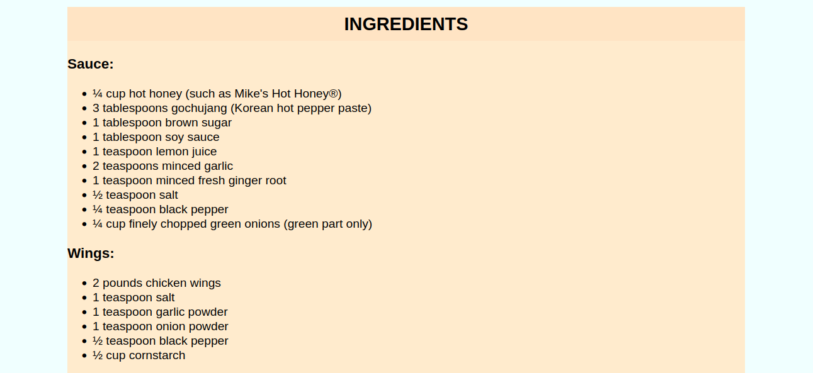
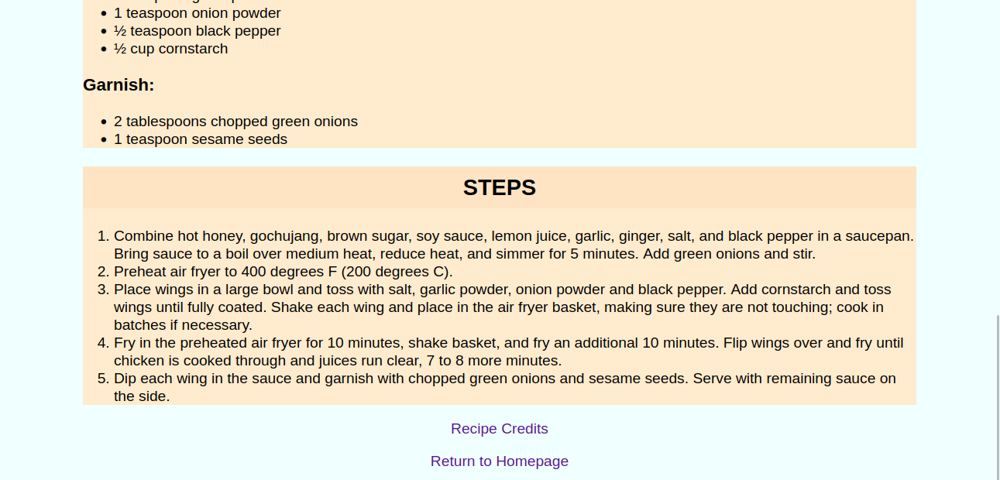

# odin-recipes

A simple web page for recipes: [take a look](https://thabomcodes.github.io/odin-recipes/)

## Links for the project

- Assignment: [The Odin Project](https://www.theodinproject.com/lessons/foundations-recipes)
- Recipe credits: https://www.allrecipes.com/

## Screenshots

